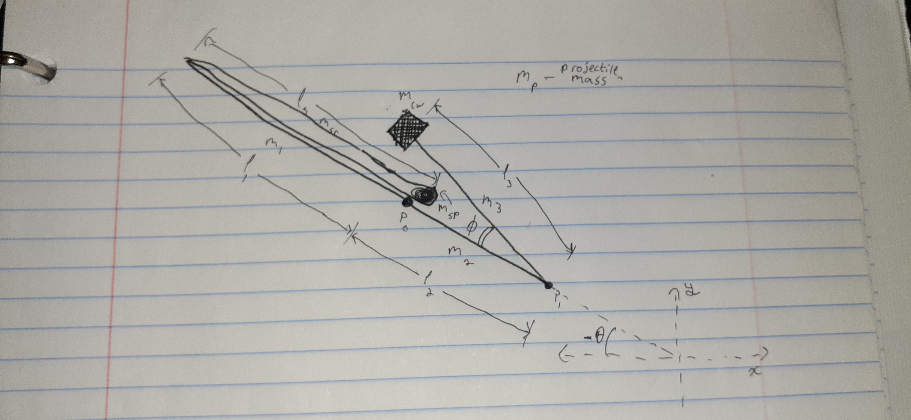

# trebsim
A simulator for whipper-style trebuchets using an approach of rotational dynamics using GNU Octave (a free MatLab equivalent)

Created October 2022 (published to GitHub in December 2022)

# How to use
Enter the parameters of the trebuchet into parameters.m, and run sim.m

# How it Works
This treats the whipper trebuchet as a system of rods and point masses to approximate its motion and dynamics.
Octave's numerical ODE algorithm is then used to solve the resulting differential equations.

The diagram below shows the variables that are used:

# Shortcomings
The sling is also treated as a rod and point mass, meaning any curvature or propagation of motion across the sling is not accounted for.

# To-dos:
Simulation of the sling as it deploys is incomplete.
Simulation of the projectile as it releases and of the release point is incomplete.
